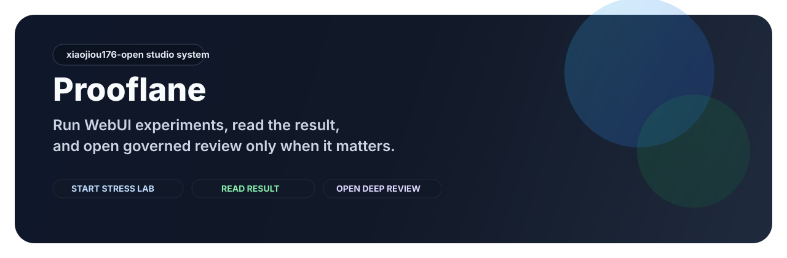
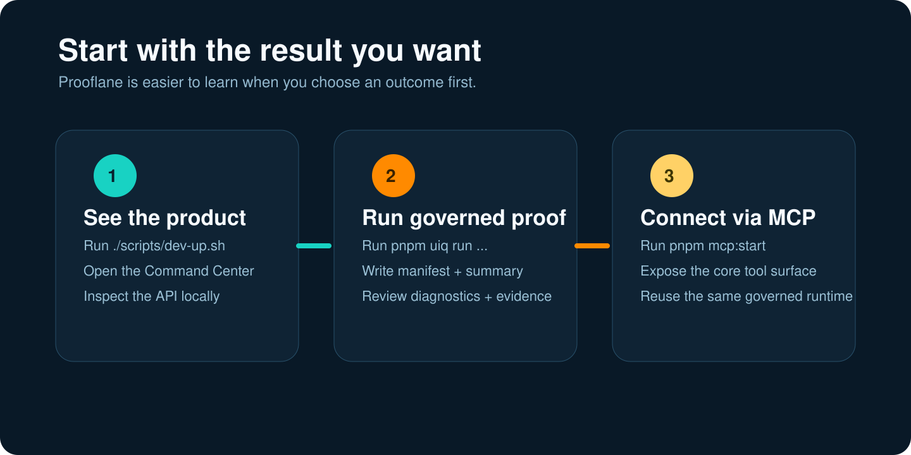
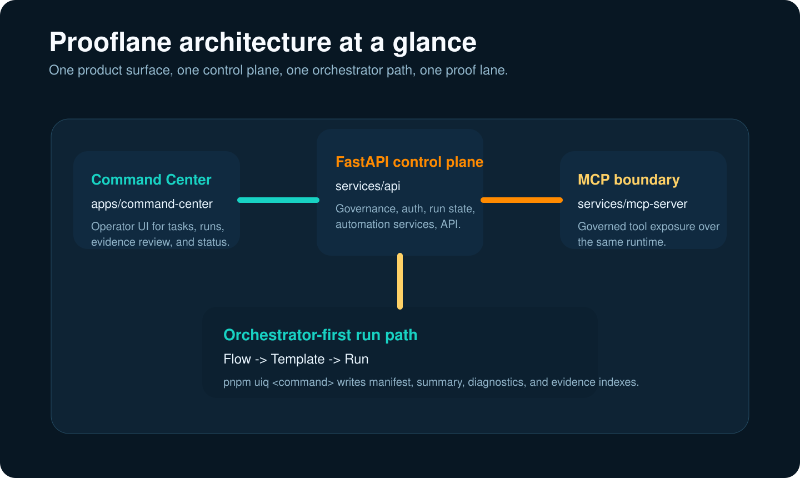

# Prooflane

> Prooflane is an AI-native WebUI stress lab for localhost-first browser
> experiments, with governed proof and agent-ready workflows when results need
> deeper review.

[Start with results](./docs/get-started.md) ·
[MCP quickstart](./docs/how-to/mcp-quickstart-1pager.md) ·
[Distribution truth](./DISTRIBUTION.md) ·
[Docs map](./docs/index.md)



## What this repo is

| Layer | Short answer | Why it matters |
| --- | --- | --- |
| Category | **AI-native WebUI stress lab** | Start from a target URL and run browser experiments without stitching together ad hoc scripts and CI fragments. |
| First visible win | **Target-first experiment -> readable result** | A newcomer should get one clear result path before opening proof/governance depth. |
| Deeper layer | **Governed proof + agent-ready workflows** | MCP, AI review, and release briefs stay behind the first experiment result instead of replacing the front door story. |

## Primary Product vs Companion Surfaces

Use this like a museum map:

| Surface | Role | What it proves | What it must not be mistaken for |
| --- | --- | --- | --- |
| `README.md` + `docs/get-started.md` + the local stress-lab shell | primary product lane | Prooflane is an AI-native WebUI stress lab | a package listing, a browser extension, or a hosted SaaS proof |
| `docs/proof-center.md` + `Advanced Review` story | deeper governed layer | proof, review, and AI summaries still exist behind the first result | the first-use front door |
| `services/mcp-server/` + `docs/skills/prooflane-mcp/` | companion integration lane | MCP-capable clients can attach to the same governed runtime | the main product identity or proof that a marketplace/package listing already happened |

In plain language:

> browser-adjacent does not mean browser-extension product.
> MCP-ready does not mean package-listed.

## Start with one visible win

Choose the shortest honest path before you read the heavier engineering stack:

1. **No local setup yet?** Open the
   [public-safe guided demo](./docs/examples/public-stress-lab-guided-demo.md).
2. **Want the real shell locally?** Start with
   [docs/get-started.md](./docs/get-started.md), then run `./scripts/dev-up.sh`.
3. **Want MCP after the first result exists?** Read
   [MCP quickstart](./docs/how-to/mcp-quickstart-1pager.md) and
   [INTEGRATIONS.md](./INTEGRATIONS.md).




## Distribution Truth Today

Prooflane already has a **public GitHub front door today**, but its package,
marketplace, and hosted lanes still stay in separate, claim-gated buckets.

- **Repo-owned now**: the localhost-first stress-lab path, governed runs, the
  repo-native MCP command `pnpm mcp:start`, and public-safe proof/demo docs.
- **Remote GitHub routes exist**: the public repository, homepage, release
  channel, Discussions, and issue templates are part of the current front-door
  route, but their current live state stays audit-backed.
- **Ready but not live yet**: the publish-ready MCP package
  `@uiq/mcp-server` and the planned `prooflane-mcp` CLI shape.
- **Companion skill host state**: the packet at `docs/skills/prooflane-mcp/`
  is now listed live on ClawHub and still `review-pending` on
  OpenHands/extensions; those receipts apply only to the companion skill lane.
- **Not published yet**: PyPI, npm registry distribution, official plugin
  marketplaces, additional public Skills registry listings beyond the ClawHub
  companion packet, public Docker images, and hosted SaaS distribution claims.
- **Audit rule**: use
  [docs/reference/public-readiness.md](./docs/reference/public-readiness.md)
  before restating live GitHub metadata, homepage, release presence, or branch
  enforcement as fresh fact.
- **Manual later**: custom GitHub social preview upload still belongs to
  GitHub Settings rather than a tracked repo action.

## New Here?

- **Want the product story first?** Start with
  [Start with results](./docs/get-started.md).
- **Want the publish-ready MCP artifact truth?** Read
  [INTEGRATIONS.md](./INTEGRATIONS.md).
- **Want the governed proof layer?** Use
  [docs/proof-center.md](./docs/proof-center.md) and
  [docs/mcp.md](./docs/mcp.md).
- **Want the MCP-capable client path?** Start with
  [docs/how-to/mcp-agent-review-loop.md](./docs/how-to/mcp-agent-review-loop.md).

## 30-Second First Look

If you want the fastest visible result, start the local stress-lab shell
first. This is the quickest way to confirm that the Command Center and API boot
on your machine after setup. It is not the same thing as producing governed run
proof.

```bash
./scripts/dev-up.sh
```

If this is your first time in a fresh checkout, bootstrap once and then launch:

```bash
./scripts/setup.sh && ./scripts/dev-up.sh
```

What you should see:

- The Command Center on `http://127.0.0.1:17373`
- API health on `http://127.0.0.1:17380/health/`
- A live Stress Lab surface with URL-first parameters, lab-mode guidance, Runs & Blocks, and Advanced Review instead of a static docs-only experience

The preview card above is the current **public-facing shell map** for the
launch-first IA. It is intentionally a semantic front-door visual, not a
literal runtime screenshot, so README does not freeze an outdated local shell
capture as if it were current product truth.

If you want the live maintainer-local shell, run `./scripts/dev-up.sh` and use
the app itself as the source of truth. A governed run is a separate step and
requires a valid `GEMINI_API_KEY`. Current GitHub-side metadata and remote
enforcement remain audit-backed states. Use
[docs/reference/public-readiness.md](./docs/reference/public-readiness.md) and
the latest audit artifacts for current remote truth instead of treating a
historical closure snapshot as live GitHub proof.

## What Prooflane Gives You Right Now

Prooflane takes browser automation out of the "test folder plus tribal
knowledge" trap and turns it into an **AI-native WebUI stress lab** with a
governed deep-review layer behind it.

- Start from a target URL, choose a lab mode, and run browser experiments
  without stitching together local scripts, CI fragments, and hidden debug
  artifacts.
- Check reusable journey target fit before you launch, so a saved template does
  not silently drift onto the wrong target family.
- Read the latest result, failures, waiting states, and screenshots from one
  operator surface instead of hunting through logs and test outputs.
- Use the Runs & Blocks report surface to jump from the latest run into summary
  and lens-specific artifact paths, and treat the Manual Gate inbox as the
  operator queue for paused runs.
- Switch the operator shell guidance between **English** and **简体中文**
  without changing command ids, artifact paths, or MCP/API contracts.
- Escalate into proof campaigns, AI findings, and governed comparison only when
  the experiment result needs deeper review.
- Read grouped AI findings in Advanced Review by severity and finding family,
  not as one flat pile of review output.
- Use the cross-target feasibility advisor when a reusable journey needs to
  move across target families, so migration hints stay attached to the same
  governed review surface.
- Copy an **agent handoff prompt** from Advanced Review when you want Codex,
  Claude Code, or another MCP-capable client to continue the same governed
  follow-up without rebuilding the run context by hand.
- Switch key shell guidance between English and Simplified Chinese when you
  want the main navigation, onboarding, and help surfaces to match the
  operator's preferred reading language.
- Connect Codex, Claude Code, or another MCP-capable client to the same deeper
  layer through release-brief, similar-failure, feasibility, and manual-gate
  read surfaces instead of a generic chat wrapper.
- Keep AI and MCP as amplifiers over the same runtime instead of inventing a
  second truth surface.
- Reuse the same substrate for exploration, stress, performance, resilience,
  visual, and accessibility work.

## Product Map

This is the shortest way to understand how the layers fit together without
turning the homepage into a slogan pileup.

| Layer | What it means |
| --- | --- |
| Main product | Prooflane is an **AI-native WebUI stress lab** for localhost-first browser experiments. |
| First-use path | Start with a target, choose a lab mode, read the latest result, then refine or compare. |
| AI layer | AI writes briefs, summarizes findings, and suggests next checks after a result exists. |
| MCP layer | MCP gives coding agents and operator copilots access to the same runtime and governed read surfaces through a real MCP server, not a fake chat wrapper. |
| Proof / review layer | Governed proof and `Advanced Review` are the deeper layer for comparison, audits, and handoff. |

## Bilingual Shell

The Command Center now keeps the same operator path available in **English**
and **简体中文** for the highest-traffic shell guidance.

- Use the language toggle in the header when you want bilingual navigation,
  onboarding, review framing, parameter guidance, and operator feedback chrome.
- Command ids, artifact paths, MCP tool ids, and API routes stay stable across
  both languages.
- Detailed runtime diagnostics remain English-first today, so operators and
  agent logs keep one contract while the shell guidance becomes easier to scan.
- Advanced Review also drafts a copy-ready agent handoff prompt, so bilingual
  operators can switch shell guidance language without changing the underlying
  Codex / Claude Code / MCP workflow contract.
- Flow Studio, confirmation dialogs, toasts, and the latest operator shell
  feedback now follow the same bilingual shell layer instead of dropping back
  to English-only chrome at the edges.

## Start With Results

Choose the path that matches the result you want first. Governance and deep
references come after the first visible win.

| I want to... | Run this | What you get |
| --- | --- | --- |
| Understand the product without local setup | Open [the guided demo](./docs/examples/public-stress-lab-guided-demo.md) | A public-safe walkthrough of the target -> experiment -> result -> advanced-review path |
| See the stress-lab shell fast | `./scripts/dev-up.sh` | Command Center on `http://127.0.0.1:17373`, API health on `http://127.0.0.1:17380/health/`, and a live Stress Lab surface when dependencies are already installed |
| Bootstrap then open the stress lab | `./scripts/setup.sh && ./scripts/dev-up.sh` | The same stress-lab surface, plus local dependencies and Playwright installed for a fresh checkout |
| Run a localhost-first governed experiment | `GEMINI_API_KEY=<your-key> pnpm uiq run --profile deep-localhost --target web.any-localhost --base-url http://127.0.0.1:3000` | A governed run for a localhost WebUI that writes `manifest.json`, `reports/summary.json`, diagnostics indexes, and evidence indexes under `.runtime-cache/artifacts/runs/<runId>/` |
| Connect the platform through MCP | `pnpm mcp:start` | The core Prooflane tool surface for MCP-capable clients |

For a step-by-step path, go to [docs/get-started.md](./docs/get-started.md).

MCP packaging note:

- the publish-ready artifact target is `@uiq/mcp-server`
- the planned CLI name is `prooflane-mcp`
- the truthful package-launch shape is `npx -y @uiq/mcp-server` or
  `pnpm dlx @uiq/mcp-server`
- that package shape is **ready in repo, not published yet**

## Current Route B Boundary

Prooflane is now deliberately telling the **stress-lab-first** story at the
front door, but the current MVP is still **localhost-first / governed-target
first**.

- `web.any-localhost` is the current honest “any WebUI” bridge for local apps.
- `--base-url` is guarded to `localhost`, `127.0.0.1`, or `::1` unless a
  target explicitly allowlists something broader.
- Advanced Review, proof campaigns, AI summaries, and MCP remain available, but
  they are the deeper layer after the first experiment result exists.

## Run Lanes At A Glance

Not every surface that says "run" means the same thing.

| Surface | What it is for | Primary truth / output |
| --- | --- | --- |
| `./scripts/dev-up.sh` | Boot the local product UI + API | `.runtime-cache/dev/*`, local logs, local health surfaces |
| `POST /api/runs` | Create a workflow run from saved templates in the operator product | Universal workflow ledger (`Session -> Flow -> Template -> Run`) |
| `POST /api/automation/run` | Queue an allowlisted automation command such as `script-pipeline-capture` or `script-pipeline-full` | `AutomationTask` ledger |
| `pnpm uiq run --profile ... --target ...` | Produce governed experiment evidence and deeper proof | `.runtime-cache/artifacts/runs/<runId>/manifest.json` and related reports |
| `pnpm mcp:start` | Expose the API + governed proof surfaces to MCP clients | Reuses the same API and governed artifact bundle contracts |

The canonical run-lane contract lives in
[docs/architecture.md](./docs/architecture.md). Read that contract before
treating `/api/runs`, `/api/automation/run`, and `pnpm uiq run` as
interchangeable.

## One Stress-Lab Journey

If you are new to the product surface, this is the shortest mental model:

1. **Start in Stress Lab** when you want to point the system at a WebUI and
   choose the kind of experiment to run.
2. **Move to Runs & Blocks** when you need to inspect the latest outcome,
   follow execution, or clear a manual gate.
3. **Open Flow Studio** when the result tells you the journey itself needs to
   be refined.
4. **Open Advanced Review** only when you already have a meaningful result and
   need governed comparison, AI summaries, or proof bundles.

Think of these pages as **start**, **read**, **refine**, and **deep-compare**.
They are related, but they are not interchangeable truth surfaces.


## Why Teams Reach For Prooflane

### 1. It starts from the WebUI you care about

Prooflane does not start with a governance board. It starts with the target URL
and the experiment question: explore, load, perf, chaos, visual, or
accessibility.

### 2. It keeps results readable before it asks for deeper proof

The operator shell is being realigned so you can read the latest experiment
result first, then decide whether you need Flow Studio or Advanced Review.

### 3. It still preserves governed depth when you need it

Proof bundles, AI summaries, manual-gate tooling, and MCP do not disappear in
Route B. They move behind the lab result as the deeper layer for comparison,
handoff, and governance.

## Why Prooflane Instead Of The Usual Alternatives

| Option | Good at | What breaks down | Why Prooflane is different |
| --- | --- | --- | --- |
| Raw Playwright scripts | Fast local experiments | Ownership, visibility, reusable proof, and repeatable result reading | Prooflane adds a stress-lab shell, governed run bundles, and deeper review surfaces |
| CI-only quality gates | Hard blocking checks | Weak operator context and weak debugging ergonomics | Prooflane connects failures back to experiment results, diagnostics, and governed proof |
| Synthetic monitoring or perf-only tools | One slice of the browser story | Weak coverage across interaction, chaos, visual, and accessibility signals | Prooflane keeps multiple browser lab modes on one substrate |

See the longer positioning note in [docs/why-prooflane.md](./docs/why-prooflane.md).

## Public Proof, Not Vibes

We want the public repo to show more than opinions. The public story has one
public-safe sample surface and a set of contracts around it:

- [docs/proof-center.md](./docs/proof-center.md): the public proof map, the
  single public-safe proof sample, and the boundary between public-safe and
  private-only evidence
- [docs/architecture.md](./docs/architecture.md): canonical architecture and
  primary execution path
- [docs/reference/ci-governance.md](./docs/reference/ci-governance.md):
  required CI topology and thresholds
- [docs/reference/public-readiness.md](./docs/reference/public-readiness.md):
  public boundary stance
- [CHANGELOG.md](./CHANGELOG.md): current shipping history
- [docs/releases/v0.1.0-public-launch.md](./docs/releases/v0.1.0-public-launch.md):
  first public release notes
- [docs/releases/v0.1.0-public-closure.md](./docs/releases/v0.1.0-public-closure.md):
  closure record for the first public Prooflane surface

In this repo, **proof** means governed evidence that can be revisited later. It
does **not** mean every operator panel, log line, or local screenshot. The
Command Center helps you work with runs, but the governed proof lane is still
the source of release-grade evidence.

If you want a no-setup walkthrough of this exact layering, start with the
[public-safe guided demo](./docs/examples/public-stress-lab-guided-demo.md).

Mock-backed usability studies stay out of the public-proof lane. They are
internal design evidence, not public proof.



## Why Star Prooflane Now

Star the repo if you want a front-row seat to the public build-out of:

- An AI-native WebUI stress lab, not just another test helper
- Public proof surfaces that make experiment results and governed review easier
  to trust
- MCP-native operator workflows for browser testing and deeper comparison
- A stronger open workflow around releases, discussions, proof publishing, and
  differentiated docs

Starring now is useful if you care about where browser automation is heading,
even before you adopt the full stack in production.

## Docs By Depth

| If you want... | Start here |
| --- | --- |
| The fastest first win | [docs/get-started.md](./docs/get-started.md) |
| The testing pyramid and coverage map | [docs/reference/testing-strategy.md](./docs/reference/testing-strategy.md) |
| The product story and differentiation | [docs/why-prooflane.md](./docs/why-prooflane.md) |
| Public evidence and boundary rules | [docs/proof-center.md](./docs/proof-center.md) |
| The first public release story | [docs/releases/v0.1.0-public-launch.md](./docs/releases/v0.1.0-public-launch.md) |
| A map of the documentation stack | [docs/index.md](./docs/index.md) |
| Runtime, contracts, and architecture truth | [docs/architecture.md](./docs/architecture.md) |
| MCP usage | [docs/how-to/mcp-quickstart-1pager.md](./docs/how-to/mcp-quickstart-1pager.md) |

## Public Boundary

Prooflane is public, but broad runtime evidence and failure bundles remain
private-only by default unless a path is explicitly allowlisted as public-safe.

- Public boundary: [docs/reference/public-readiness.md](./docs/reference/public-readiness.md)
- Public artifact policy:
  [docs/reference/public-artifact-policy.md](./docs/reference/public-artifact-policy.md)
- CI and branch-protection truth:
  [docs/reference/ci-governance.md](./docs/reference/ci-governance.md)
- GitHub-side metadata such as homepage, topics, social preview, and security
  settings stay audit-backed and should be verified through the latest
  public-surface or branch-protection audit artifacts instead of repo prose
- Secret-backed live, desktop, and privileged governance workflows stay on
  GitHub-hosted runners and bind the `owner-approved-sensitive` protected
  environment instead of relying on any shared maintainer runner pool

## Stack

- Python = 3.12.x
- Node.js = `20.x`
- pnpm = `10.22.0`
- Product UI: `apps/command-center/`
- API control plane: `services/api/`
- Orchestrator entry: `pnpm uiq <command>`
- MCP adapter: `services/mcp-server/`
- Canonical architecture:
  [docs/architecture.md](./docs/architecture.md)
