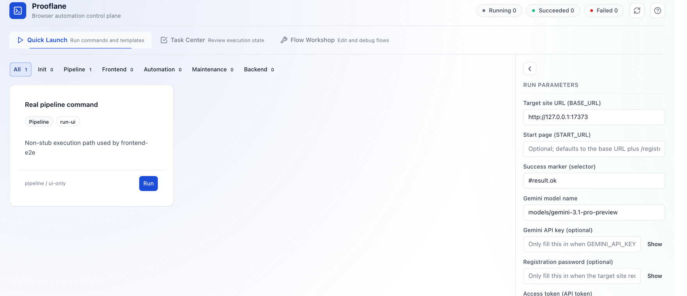

# Get Started

Prooflane makes the most sense when you start from the **WebUI you want to
test**, not from the installation checklist.

This page separates three different wins:

- A public-safe guided walkthrough you can read without local setup
- A local, visible stress-lab shell that shows the UI and API boot on your machine
- A localhost-first governed experiment that writes reusable evidence
- An MCP connection path for Codex, Claude Code, or another MCP-capable client

## No Local Setup Yet?

If you want to understand the product before you install anything, start with
the [public-safe guided demo](./examples/public-stress-lab-guided-demo.md).

That demo is read-only and safe to share. Think of it like a museum walkthrough:
it shows the main rooms, the public-safe sample, and the AI/MCP layers without
opening the private runtime storeroom.

## 30-Second First Look

If your dependencies are already installed, this is the fastest visible path:

```bash
./scripts/dev-up.sh
```

This confirms the stress-lab surface boots locally. It does not yet prove a
governed run.

What success looks like:

- Command Center is available at `http://127.0.0.1:17373`
- API health responds at `http://127.0.0.1:17380/health/`
- The Stress Lab surface shows URL-first inputs, lab modes, and the same shell that leads into Runs & Blocks and Advanced Review
- The header locale toggle can switch the highest-traffic shell guidance between **English** and **简体中文** without changing command ids or API routes
- The shell can now keep navigation, onboarding, help, Flow Studio guidance, parameter panels, dialogs, and operator feedback chrome aligned in English or Simplified Chinese



This screenshot is a current local first-look capture of the English product
surface. It is useful for orientation, but the running app and the latest
audit artifacts still remain the source of truth for current behavior and live
GitHub state.

If this is your first run in a fresh checkout, bootstrap once first:

```bash
./scripts/setup.sh && ./scripts/dev-up.sh
```

> Local first look and governed experiment proof are different checkpoints.
> Think of it like opening the lab door versus finishing a supervised test
> session: both matter, but they prove different things.

## Pick Your First Win

| Goal | Best path | Outcome |
| --- | --- | --- |
| Understand the product without booting it | [Guided demo](./examples/public-stress-lab-guided-demo.md) | Walk through the target -> experiment -> result -> advanced-review path with public-safe assets only |
| See the stress lab in action | Local stack path | Open the Command Center and API locally |
| Produce a localhost-first governed experiment | Orchestrator path | Generate a run manifest, summary, and proof indexes for a localhost WebUI with a valid `GEMINI_API_KEY` |
| Connect from an MCP client | MCP path | Expose the same runtime to an agent or operator client |


## Current Route B Boundary

The front door is now stress-lab-first, but the honest MVP is still
**localhost-first**:

- use `web.any-localhost` when you want a governed target that can point at
  different localhost ports
- use `--base-url` to set the exact local WebUI origin you want to test
- do not assume arbitrary public URLs are open by default; the current
  guardrail stays fail-closed outside governed allowlists

## Run Lane Map

Prooflane uses several run surfaces on purpose.

| Surface | Think of it as | What it writes |
| --- | --- | --- |
| `./scripts/dev-up.sh` | Turn on the dashboard | Local UI/API runtime state only |
| `POST /api/runs` | Start a saved workflow from the product | Workflow ledger records under `.runtime-cache/automation/universal/` |
| `POST /api/automation/run` | Queue a named command | `AutomationTask` execution records |
| `pnpm uiq run --profile ... --target ... --base-url ...` | Produce a governed experiment result | Run bundle under `.runtime-cache/artifacts/runs/<runId>/` |
| `pnpm mcp:start` | Expose the above through MCP | Reuses API + governed bundle contracts |

> `/api/runs`, `/api/automation/run`, and `pnpm uiq run` are related, but they
> are **not the same lane**. If you care about release-grade proof, use the
> governed `pnpm uiq run` path.

## How The Product Surfaces Fit Together

If you open the local app and feel like there are several “run” pages, use this
simple map:

- **Stress Lab** starts work. Use it to set the target, choose the lab mode,
  and launch commands or template-backed runs.
- **Stress Lab** now lets selected reusable journeys run a target-fit check
  before launch, so you can catch obvious cross-target mismatches earlier.
- **Runs & Blocks** follows work. Use it to monitor status, inspect results,
  and clear manual blockers.
- **Runs & Blocks** also acts as the latest report surface: summary/lens
  artifact paths and the Manual Gate inbox now sit on the same result desk.
- **Flow Studio** refines work. Use it when the journey behind the result needs
  deeper editing or replay.
- **Advanced Review** judges work. Use it when you already have review-ready
  governed runs and want to compare evidence or inspect proof campaigns.
- **Advanced Review** now groups AI findings by severity and finding family, so
  the deeper layer stays readable instead of turning into one flat list.
- **Advanced Review** also keeps cross-target feasibility advice beside the
  rest of the review context, so template migration hints stay attached to the
  same run-driven decision surface.

That means the fastest first look is not the same as the release-review path.
You can start in the app, but you still need governed proof when you want
repeatable release evidence.

## Path 1: Launch The Stress Lab Locally

Use this path when you want to experience Prooflane as a stress lab, not just
as a set of scripts.

This path is the honest "I can see the lab working locally" checkpoint. It does
not consume a Gemini key and it does not write the governed run bundle.

### Step 1. Set up the workspace

```bash
./scripts/setup.sh
```

### Step 2. Start the local stack

```bash
./scripts/dev-up.sh
```

### Step 3. Open the operator surfaces

- Command Center: `http://127.0.0.1:17373`
- API health: `http://127.0.0.1:17380/health/`

### Stop the stack

```bash
./scripts/dev-down.sh
```

## Path 2: Produce A Localhost-First Governed Experiment

Use this path when you care about proof, repeatability, and gate-aligned run
artifacts for a real local WebUI.

This path is stricter than the local UI path because it is the one that writes
the governed run bundle.

```bash
GEMINI_API_KEY=<your-key> pnpm uiq run --profile deep-localhost --target web.any-localhost --base-url http://127.0.0.1:3000
```

Replace `http://127.0.0.1:3000` with the local WebUI you actually want to
test.

What this gives you:

- A run manifest under `.runtime-cache/artifacts/runs/<runId>/manifest.json`
- A summary under `.runtime-cache/artifacts/runs/<runId>/reports/summary.json`
- Diagnostics and evidence indexes for later review
- A real lab report substrate for explore, chaos, a11y, perf, visual, and load

Current note from local verification: governed profiles enforce a strict Gemini
preflight. If `GEMINI_API_KEY` is missing, the run stops with
`reasonCode=ai.gemini.strict_policy_violation`.

If you want to inspect a public-safe example before wiring a key, use the
single sample linked from [docs/proof-center.md](./proof-center.md) or the
[public-safe guided demo](./examples/public-stress-lab-guided-demo.md).

If you want the deeper contract, read
[docs/architecture.md](./architecture.md).

## Path 3: Connect Through MCP

Use this path when you want Prooflane to show up as a controlled tool surface
inside an MCP-capable client such as Codex, Claude Code, or another MCP host.

```bash
pnpm mcp:start
```

By default the MCP server targets its managed backend lane at
`http://127.0.0.1:18080`. If you want MCP to attach to the local
`./scripts/dev-up.sh` stack instead, export:

```bash
UIQ_MCP_API_BASE_URL=http://127.0.0.1:17380
```

Then continue with:

- [docs/how-to/mcp-agent-review-loop.md](./how-to/mcp-agent-review-loop.md)
- [docs/how-to/mcp-clients-setup.md](./how-to/mcp-clients-setup.md)
- [docs/how-to/mcp-quickstart-1pager.md](./how-to/mcp-quickstart-1pager.md)

Remember that MCP is a connection layer over the same governed runtime. It is
not a second truth surface that replaces workflow runs or governed proof.

## What To Read Next

- Product story: [docs/why-prooflane.md](./why-prooflane.md)
- Public proof map: [docs/proof-center.md](./proof-center.md)
- Repo-side public boundary and remote-audit paths:
  [docs/reference/public-readiness.md](./reference/public-readiness.md)
- FAQ: [docs/faq.md](./faq.md)
- Full docs map: [docs/index.md](./index.md)
